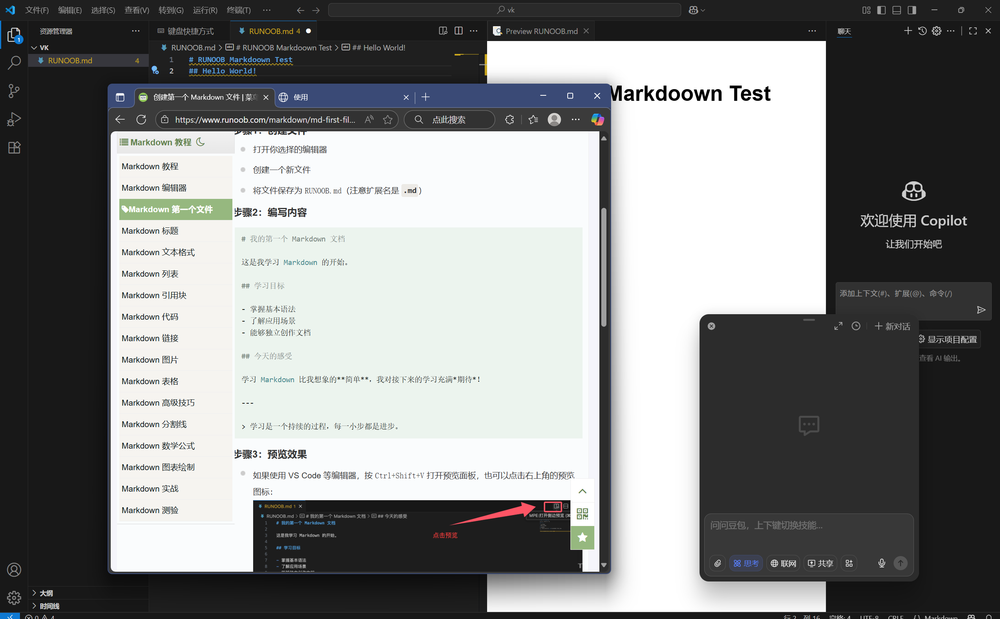

# *我的Markdown学习*😊

---
## 🧠一.解题思考过程:

看到题目后,我理解到我需要学习一门轻量简洁的格式---<u>**Markdown**</u>.
>Markdown 是一种 轻量级标记语言，简单来说就是： 写起来像 txt 一样清爽，渲染出来却能像 Word 一样整齐美观.             ---Cupa

同时,需要注意**图片提交的问题**,以及出题者插入链接的"**菜鸟教程-Markdown基础**"

##  🖥️二.使用的文本编辑器

###### 我**pick**了==VSCode==来编写Markdown:
- 我可以通过安装相关扩展来实现Markdown的编写与预览功能
- 我可以借此更加熟悉VSCode
- 使用**VSCode**能和代码开发环境结合

## 📙三.参考学习资料

###### 为了学会Markdown,我参考了这些资源

1. ✅ **[菜鸟教程-Markdown基础](https://www.runoob.com/markdown/md-link.html)**:😘
    学习了核心语法,比如标题(`#`到`######`)、列表(`-`/`*`无序列表,`1.`有序列表)、使用链接等S
2. ✅ **[B站视频](https://www.bilibili.com/video/BV1hG411p7fX?t=1034.5)**:
学习了如何使用emoji表情
3. ✅ **[Github相关资源](https://github.com/Sakiyary/Markdown-Typora-VSCode-Doc)**
4. ✅**向豆包老师寻求帮助**

## 四.总结

通过这次学习，我不仅掌握了 Markdown 核心语法，还熟悉了 VSCode 中 Markdown 相关的插件与工作流，理解了 “相对路径” 和 “工具选择” 对文档提交的影响。S